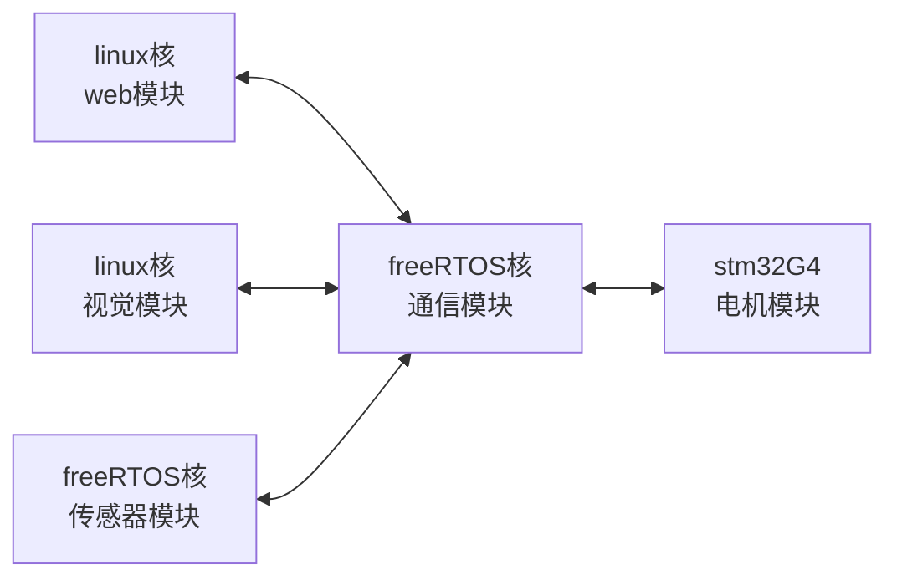

# 智能温控系统


- 最后修改日期: 2026-05-11

- 版本：V0.0.1

## 硬件选型

本系统使用 `milkV Duo256M` + `STM32G431RBT6`。

### Duo256M 主控

`milkV Duo256M` 有 4 个 CPU 核心：

```text
SG2002
├── Cortex-A53 @1GHz    （ARM 64位）
├── C906 @1GHz          （RISC-V 64位）
├── C906 @700MHz        （RISC-V 64位）
└── 8051 MCU @25~300MHz （低功耗单片机）

```

本项目中，我们启用 `C906 @1GHz` 作为大核运行 _linux_ 系统，启用 `C906 @700MHz` 作为小核运行 _freeRTOS_ 系统。

### STM32G431RBT6 电机驱动从机


### DHT11 温湿度监控从机

### 图像传感器从机

## 软件设计

本项目设有 `web模块`、`视觉模块`、`电机模块`、`传感器模块` 与 `通信模块`。

### 模块关系



说明：

- 所有软件模块 仅 向 `通信模块` 发送数据
- 所有模块 仅 受 `通信模块` 传递的数据
- 由 `通信模块` 决定数据流向
- _linux_ 核 与 _freeRTOS_ 核 之间通过 `mailbox 信箱` 机制通信
- _Duo256M_ 板 与 _STM32G4_ 板 之间通过 `CAN 总线` 通信

## 仓库设计

本项目地址如下：

```URL
https://github.com/AET-ITCS
```

内有如下仓库（暂定）：

```text
AET-ITCS
├── ITCS-DOCS       文件仓库
├── ITCS-WEB        web界面仓库 (未搭建)
├── ITCS-VISION     视觉算法仓库 (未搭建)
├── ITCS-MODRI      电机驱动仓库 (未搭建)
└── ITCS-COM        通信模块仓库 (未搭建)   
```