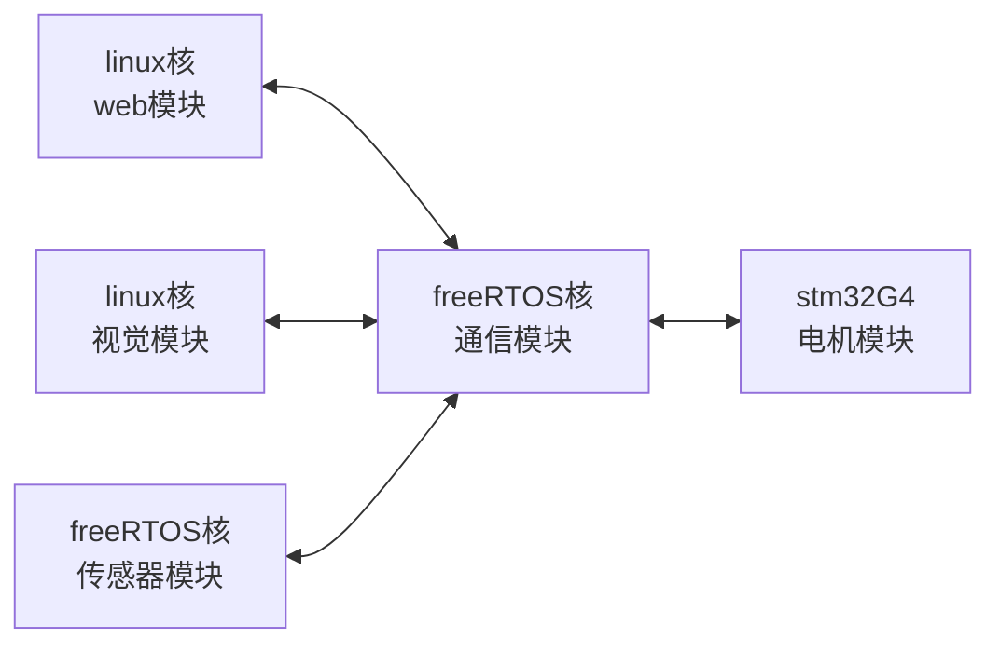

# 智能温控系统（含BLDC热管理）需求规格说明书

## 1. 引言

### 1.1 项目背景
随着现代智能汽车电子电气架构的演进，车辆控制逻辑正呈现“逻辑上移，执行下沉”的趋势。本项目旨在开发一套基于嵌入式 Linux 的智能温控系统，涵盖 BLDC（无刷直流电机）热管理控制。通过本项目，验证域控制器与智能执行器节点之间的协同工作模式，以及基于 Web 的智能座舱 HMI（人机交互界面）的可行性。

### 1.2 编写目的
本文档旨在明确基于嵌入式 Linux 的智能温控系统的整体架构、功能模块拆解、核心技术栈、验收指标及风险规划，为后续的软硬件开发、系统集成和测试提供依据和指导。

---

## 2. 系统总体架构映射（硬件即现实）

本系统硬件架构完美映射了现代智能汽车的控制趋势：

### 2.1 座舱域控制器（“大脑”）
- **硬件平台**：Milk-V Duo 256M 开发板
- **系统角色**：充当系统的“大脑”，运行嵌入式 Linux 操作系统。
- **核心职责**：负责处理非实时的、复杂的上层业务逻辑，如接收用户的 HMI 屏幕触控指令、根据车内外温度计算所需的冷气/热气量，并制定全局热管理控制策略。

### 2.2 智能执行器节点（“小脑”与“肌肉”）
- **硬件平台**：STM32G431RBT6 控制芯片 + X-STAR-S_FOC&BLDC 开发板
- **系统角色**：充当系统的“小脑”与“肌肉”。STM32G4 系列专为电机控制打造，内置数学协加速器 CORDIC 及高级定时器。
- **核心职责**：专注于底层硬件控制，接收来自主控域控制器的目标转速/扭矩指令，并以极高的实时性（10kHz+ 频率）运行 FOC（磁场定向控制）算法发波。

### 2.3 物理执行机构
- **硬件平台**：BL4260 无刷直流电机
- **系统角色**：作为系统最终的物理执行机构。
- **核心职责**：模拟汽车 HVAC（暖通空调）系统的鼓风机，或者电池包液冷系统中的电子水泵与散热风扇。

### 2.4 软件模块架构

本项目设有 `web模块`、`视觉模块`、`电机模块`、`传感器模块` 与 `通信模块`。



**模块通信原则**：
- 所有软件模块 **仅向** `通信模块` 发送数据。
- 所有模块 **仅接收** 由 `通信模块` 转发的数据。
- 由 `通信模块` 统一决定数据流向，实现模块间解耦。
- `Linux` 核 与 `freeRTOS` 核之间通过 **mailbox 信箱** 机制通信。
- `Duo256M` 板 与 `STM32G4` 板之间通过 **CAN 总线** 通信。

### 2.5 CPU 核心分配

`Milk-V Duo 256M` 搭载 SG2002 芯片，共 4 个 CPU 核心：

```text
SG2002
├── Cortex-A53 @1GHz    （ARM 64位）
├── C906 @1GHz          （RISC-V 64位）
├── C906 @700MHz        （RISC-V 64位）
└── 8051 MCU @25~300MHz （低功耗单片机）
```

本项目核心分配方案：
- **C906 @1GHz**（大核）：运行 **Linux** 系统，承载 `web模块` 与 `视觉模块`。
- **C906 @700MHz**（小核）：运行 **freeRTOS** 系统，承载 `通信模块` 与 `传感器模块`。
- **Cortex-A53 @1GHz**：预留，未启用。
- **8051 MCU**：预留，可用于超低功耗场景的辅助管理。

---

## 3. 项目技术分析

### 3.1 技术架构
- **硬件层**：Milk-V Duo 256M (域控主控), STM32G431RBT6 (电机控制MCU), BL4260 (无刷电机), X-STAR-S 开发板。
- **驱动层**：STM32 HAL 库, FOC 算法控制模型, UART+DMA 驱动。
- **系统层**：Milk-V 嵌入式 Linux 操作系统 (Buildroot/Yocto 等环境构建)。
- **应用层**：C++/Python 热管理 PID 控制服务, Node.js/Flask/Mongoose 轻量级 Web 服务器, Web 前端 HMI。
- **通信协议**：CAN 总线协议 (CAN，域控与STM32之间), HTTP/WebSocket (Web HMI与域控之间)。

### 3.2 关键技术点矩阵

| 技术类别 | 具体技术点 | 应用场景 / 作用 |
| :--- | :--- | :--- |
| **下位机控制** | 基于模型设计 (MBD) + FOC | STM32 实现高精度、高动态响应的电机速度闭环控制 |
| **嵌入式系统** | Linux CAN 通信与多线程 | Milk-V Duo 保证 CAN 通信与热管理策略计算并行不干涉 |
| **自动控制** | PID 控制算法 | 模拟热管理系统，根据温差动态计算鼓风机/水泵转速需求 |
| **前后端交互** | 轻量级 Web 服务 + WebSocket/AJAX | 实时推送电机状态数据至网页，实现跨端可视化座舱交互 |

---

## 4. 项目功能指标与范围

### 4.1 硬件设备与下位机功能说明

| 功能模块 | 触发条件 (Input) | 处理逻辑 (Process) | 响应反馈 (Output) | 异常处理 |
| :--- | :--- | :--- | :--- | :--- |
| **指令接收** | 收到上位机 CAN 报文帧 | 校验帧 ID 与数据内容，解析目标转速 | 更新 FOC 目标速度环参数 | 若校验错误则丢弃数据帧，并记录丢包统计 |
| **电机控制** | 实时运行 FOC 算法周期 (10kHz) | 读取霍尔位置与相电流，执行 PI 调节，生成 SVPWM 波形 | 电机平滑运转至目标转速 | 过流/堵转时立即封锁 PWM 输出，并上报故障码 |
| **状态回传** | 定时器触发 (如 50Hz) | 采集当前真实转速、母线电压、故障状态并打包 | 通过 CAN 总线发送至上位机 | 总线忙碌时延后发送，避免阻塞核心控制循环 |

### 4.2 域控与 Web HMI 功能说明

| 功能模块 | 触发条件 (Input) | 处理逻辑 (Process) | 响应反馈 (Output) | 异常处理 |
| :--- | :--- | :--- | :--- | :--- |
| **热管理闭环** | HMI 改变目标温度或虚拟环境温度变化 | 运行 PID 计算，将温差转化为目标转速指令 | 通过 CAN 总线下发新转速指令至 STM32 | CAN 通信断开时，保持最后一次安全转速或执行停机保护 |
| **状态推送** | CAN 接收到 STM32 最新状态报文 | 存储最新状态，并推送至 WebSocket/Web 缓存 | Web 前端图表刷新，显示实时转速与运行状态 | 超过 2 秒未收到心跳状态，HMI 显示设备离线警告 |

### 4.3 视觉模块功能说明

| 功能模块 | 触发条件 (Input) | 处理逻辑 (Process) | 响应反馈 (Output) | 异常处理 |
| :--- | :--- | :--- | :--- | :--- |
| **图像采集** | 图像传感器从机推送帧数据 | 接收并缓存原始图像帧，进行格式转换 | 图像帧就绪，供后续算法消费 | 帧超时未到达时标记传感器离线，通过通信模块上报 |
| **目标识别** | 图像帧就绪 + 识别任务触发 | 运行轻量级推理模型（如人形/手势检测），识别目标类别与位置 | 将识别结果（类别、坐标、置信度）发送至通信模块 | 推理超时则丢弃当前帧，记录丢帧统计 |
| **视觉联动** | 识别到特定目标（如手势/人脸） | 根据预设规则映射为控制指令 | 通过通信模块下发联动指令（如调节温度、切换模式） | 置信度不足时不触发联动，避免误操作 |

### 4.4 传感器模块功能说明

| 功能模块 | 触发条件 (Input) | 处理逻辑 (Process) | 响应反馈 (Output) | 异常处理 |
| :--- | :--- | :--- | :--- | :--- |
| **温湿度采集** | 定时轮询 DHT11 从机 | 通过单总线协议读取环境温湿度原始数据 | 校准后的温湿度值通过通信模块上报 | 校验和失败时重试 3 次，仍失败则标记传感器故障 |
| **阈值告警** | 温度/湿度超出预设阈值 | 比对当前值与安全阈值区间 | 生成告警事件并推送至通信模块 | 短暂超限（< 5s）视为抖动，不触发告警 |

### 4.5 通信模块功能说明

| 功能模块 | 触发条件 (Input) | 处理逻辑 (Process) | 响应反馈 (Output) | 异常处理 |
| :--- | :--- | :--- | :--- | :--- |
| **消息路由** | 任意模块发送数据 | 根据消息头中的目标模块 ID 查表转发 | 数据准确送达目标模块 | 目标模块未注册时丢弃并记录错误日志 |
| **Mailbox 通信** | Linux 核与 freeRTOS 核间需交换数据 | 封装 mailbox 读写接口，管理共享内存环形缓冲区 | 跨核数据透明传输 | mailbox 通道阻塞时降级为轮询模式，且上报告警 |
| **CAN 总线通信** | Duo256M 需与 STM32G4 板交换数据 | 通过 CAN 控制器收发帧，处理总线仲裁与重传 | 板间数据可靠传输 | CAN 总线错误计数超过阈值时，触发总线关闭保护并通知上位机 |
| **心跳监测** | 各模块定时上报心跳包 | 独立线程监测各模块心跳超时状态 | 模块离线事件推送至 Web HMI | 模块离线后自动重连，连续 3 次失败则标记为故障 |

---

## 5. 核心技术栈与开发任务拆解

### 5.1 任务一：STM32G431 底层电机驱动（对应 ITCS-MODRI）
- **算法建模**：在 MATLAB/Simulink 中搭建带霍尔传感器的 FOC（磁场定向控制）模型。
- **控制逻辑**：建立“速度-电流”双闭环控制系统。
- **代码生成**：利用 Simulink 的 Embedded Coder 工具自动生成底层 C 代码，并无缝集成至 STM32CubeIDE。
- **通信接口设计**：配置 STM32 的 CAN 接口，定义基于 CAN ID 的高效通讯协议。

### 5.2 任务二：Milk-V Duo 域控业务逻辑（对应 ITCS-COM）
- **热管理策略模型**：引入 PID 算法模拟恒温空调系统。当温差大时下发高转速制冷/制热，接近目标温度时降低转速。
- **通信与多线程机制**：开启独立线程，以 50Hz/100Hz 周期通过 CAN 总线向 STM32 下发转速指令，非阻塞读取 STM32 回传的电机实时状态。

### 5.3 任务三：智能座舱 HMI 开发（对应 ITCS-WEB）
- **Web 服务器部署**：在 Milk-V Duo 上部署轻量级 Web 服务器（推荐使用 Flask 或 Mongoose）。
- **前端交互效果**：开发”汽车中控屏”网页前端，提供滑块组件调节”车厢目标温度”，并绘制实时转速跟随曲线。

### 5.4 任务四：视觉模块开发（对应 ITCS-VISION）
- **图像采集驱动**：适配图像传感器从机，编写 V4L2 或专用驱动完成图像帧捕获。
- **预处理管线**：对原始帧进行缩放、色彩空间转换、去噪等预处理。
- **轻量推理部署**：在 Milk-V Duo 上部署轻量级推理框架（如 ncnn / TFLite Micro），运行目标检测或手势识别模型。
- **联动控制**：将识别结果转化为控制语义（如手势映射为温度调节指令），通过通信模块下发至相应执行器。

### 5.5 任务五：传感器模块开发（freeRTOS 核）
- **DHT11 驱动开发**：编写单总线（OneWire）时序驱动，以 1Hz 频率准确读取温湿度数据。
- **数据校准与滤波**：对读取值进行软件校准与均值滤波，消除偶发毛刺。
- **定时上报**：以固定周期（如 1Hz）将校准后的环境数据通过 mailbox 投递至通信模块。

---

## 6. 项目验收指标

1. **控制精度**：STM32 对 BL4260 电机的转速控制稳态误差不超过 `±5%`，启动与变速过程平滑无明显抖动。
2. **通信可靠性**：Milk-V 与 STM32 间的串口通信连续运行 `12h` 丢包率 `< 0.1%`，且不存在通信阻塞导致的系统死机现象。
3. **实时性要求**：HMI 滑块调整设定温度后，至电机实际转速发生响应变化的全链路延迟 `< 500ms`。
4. **HMI 稳定性**：Web 界面支持 `10Hz` 以上的动态曲线刷新率，连续运行不出现内存泄漏或界面卡顿。

---

## 7. 风险分析及应对措施

| 风险类别 | 风险描述 | 应对措施 | 负责角色 |
| :--- | :--- | :--- | :--- |
| **技术风险** | FOC 算法参数整定困难导致电机异响或震动 | 优先使用 Simulink 仿真优化 PID 参数，若进度受阻备选方案降级为六步换相逻辑以确保系统联调 | 嵌入式开发 (下位机) |
| **通信风险** | CAN 数据在 Linux 侧因调度延迟导致堆积或解析错位 | 制定带有帧 ID 过滤与长度校验的严谨协议，Linux 侧采用独立高优先级线程与环形缓冲区处理 CAN 数据流 | 嵌入式开发 (上位机) |
| **性能风险** | Milk-V 运行 Node.js 可能资源占用过高 | 若内存不足，及时重构改用 Python Flask 或极轻量的 C 语言 Mongoose 服务器 | Web/后端开发 |
| **系统稳定性** | 电机启动大电流导致电压跌落，引起 STM32 或 Milk-V 复位 | 强弱电分离供电，控制板与驱动板间增加光耦隔离或确保共地良好，加粗动力电源线 | 硬件工程师 |

---

## 8. 总结
本项目通过 Milk-V Duo 256M 和 STM32G431 的协同，实现了从上层 Web HMI、Linux 域控业务逻辑（PID 热管理），到下层 RTOS/裸机级别的高频 FOC 电机驱动的完整闭环。这不仅验证了现代汽车“中央计算+区域控制”的先进架构，也是全栈嵌入式开发能力的全面体现。
